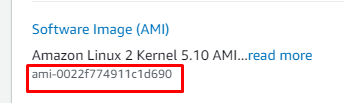

# Creating AWS EC2 instance with Terraform

- First of all I created a `main.tf` file in vs code.
- Told terraform which cloud provider I was going to work with, region, instance type and `ami` and a tag.
- I found `ami` as shown in the image below in my aws educate account:
  
  `AWS→Services→EC2→Launch Instance`
  
```
provider "aws" {
    region = "us-east-1"
}


resource "aws_instance" "my_amazon_linux" {
    ami          = "ami-0022f774911c1d690"
    instance_type = "t2.micro"

    tags = {
        Name = "My-my_amazon_linux"
        Owner = "Robin-R"
    }
}
  
```

- Changed directory in vs code terminal to where my project is located with
`cd:\Users\robin\Desktop\terraform-first-pr`
 

- Run `terraform init`to download aws provider
- It created a `.terraform` folder
- Run `terraform plan` in order to see which resources will be created. It simply checks our current directory and show what folders will be created.
- Run `terraform apply` to execute creation.
- Enter 'yes' to approve.


## `terraform.tfstate`

- All details to your resources.

## `terraform plan`
- It checks if there are any additional resources which aren't in the state file.

## `.tf`
- Configuration filesin terraform using HCL.
## Resources


## `terraform destroy`
- Inverse of `terraform apply`. It terminates resources managed by your current Terraform project.


## Create Terraform Infrastructure with Docker

- You can deploy an nginxdocker container with terraform interactively here (https://learn.hashicorp.com/tutorials/terraform/install-cli?in=terraform/aws-get-started)
- Paste this code to your `main.tf` file
```
  terraform {
  required_providers {
    docker = {
      source  = "kreuzwerker/docker"
      version = "~> 2.13.0"
    }
  }
}

provider "docker" {}

resource "docker_image" "nginx" {
  name         = "nginx:latest"
  keep_locally = false
}

resource "docker_container" "nginx" {
  image = docker_image.nginx.latest
  name  = "tutorial"
  ports {
    internal = 80
    external = 8000
  }
}
```
- Run `terraform init` and then `terraform apply`
- Verify that th container is running by typing `docker ps`

- Now we can destroy the resource by running `terraform destroy`
